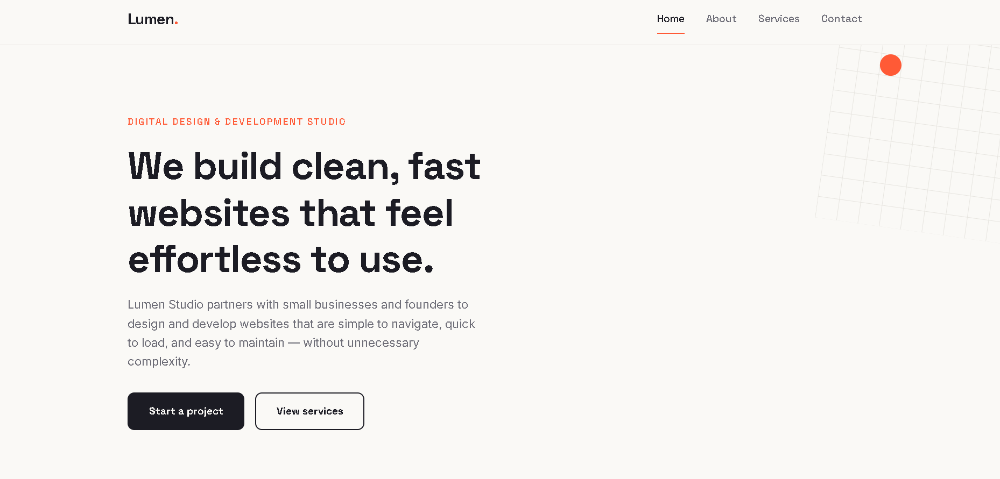
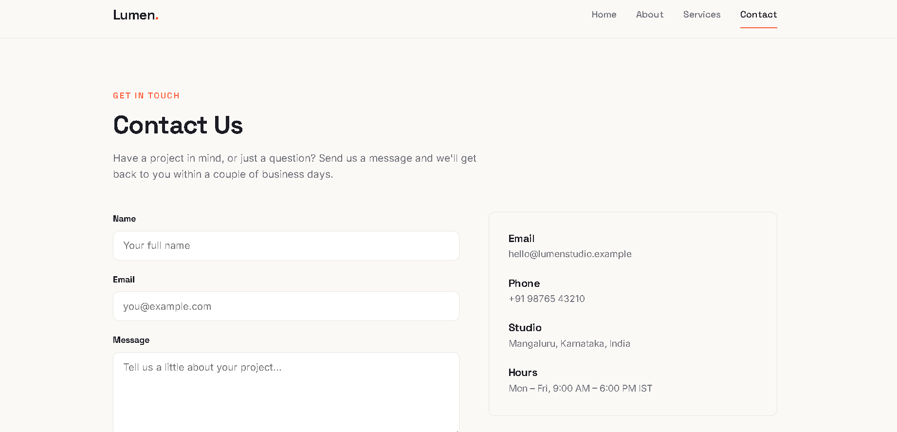
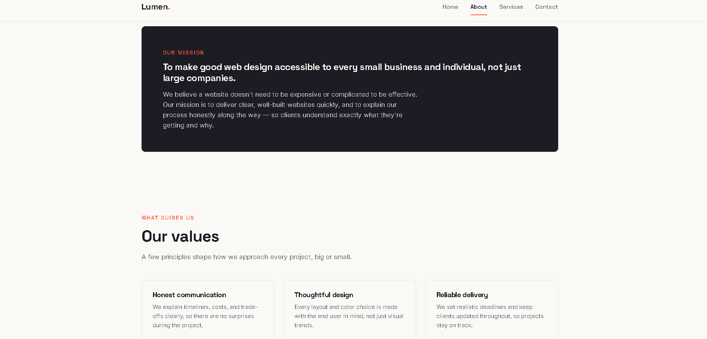
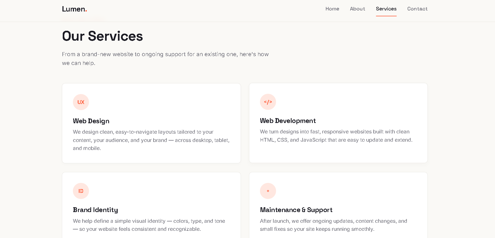

# Multi-Page Website (Task 7)

A responsive, multi-page business/portfolio-style website built with plain HTML, CSS, and JavaScript, featuring shared navigation and a validated contact form.

**Live demo:** https://sanath00007.github.io/synent-task7-multipagewebsite-sanathk/

---

## Objective

Design and build a responsive multi-page website with consistent branding and shared navigation across pages, including a working contact form with client-side validation — demonstrating multi-page site architecture using only core front-end technologies.

## Steps Performed

1. Planned the site's information architecture: **Home**, **About**, **Services**, and **Contact** pages, linked through a shared navigation bar and footer.
2. Built each page's semantic HTML structure (`index.html`, `about.html`, `services.html`, `contact.html`).
3. Created a single shared stylesheet (`style.css`) to keep typography, color scheme, spacing, and components consistent across all pages.
4. Implemented `script.js` for interactive behavior: navigation menu toggling (mobile), active-link highlighting, and contact form validation (required fields, email format checks, inline error/success feedback).
5. Made the layout responsive across breakpoints (mobile, tablet, desktop) using Flexbox/Grid and media queries.
6. Tested navigation flow and form validation across pages and screen sizes.
7. Deployed the site via GitHub Pages and documented the project.

## Tools Used

| Category | Tools / Technologies |
|---|---|
| Markup & Styling | HTML5, CSS3 (Flexbox/Grid, media queries) |
| Logic | Vanilla JavaScript (ES6) |
| Version Control / Hosting | Git, GitHub, GitHub Pages |

## Outcome

A fully responsive, four-page website with consistent shared navigation, a client-side validated contact form, and a clean, professional layout — deployed live and meeting all Task 7 deliverables.

---

## Pages

| Page | File | Description |
|---|---|---|
| Home | `index.html` | Landing page introducing the site/brand |
| About | `about.html` | Background/company or personal information |
| Services | `services.html` | Overview of services/offerings |
| Contact | `contact.html` | Contact details and a validated contact form |

## File Structure

```
.
├── index.html       # Home page
├── about.html        # About page
├── services.html     # Services page
├── contact.html       # Contact page with validated form
├── style.css          # Shared styling across all pages
├── script.js           # Navigation behavior + form validation
├── screenshots/         # Page screenshots (see below)
└── reports/              # Brief write-up / task report (see below)
```

## Getting Started

No installation or build tools required.

1. Download/clone the repository.
2. Open `index.html` in any modern web browser.
3. Navigate between pages using the shared nav bar.

## Features

- Shared, consistent navigation and footer across all four pages
- Responsive layout — adapts cleanly from mobile to desktop
- Contact form with client-side validation (required fields, email format)
- Consistent design system (colors, typography, spacing) via a single stylesheet
- No external frameworks or dependencies — pure HTML/CSS/JS

## Screenshots

> 
> 
> 
> 


## Browser Support

Works in all modern evergreen browsers (Chrome, Edge, Firefox, Safari).

## License

Free to use, modify, and distribute for personal or academic projects.
